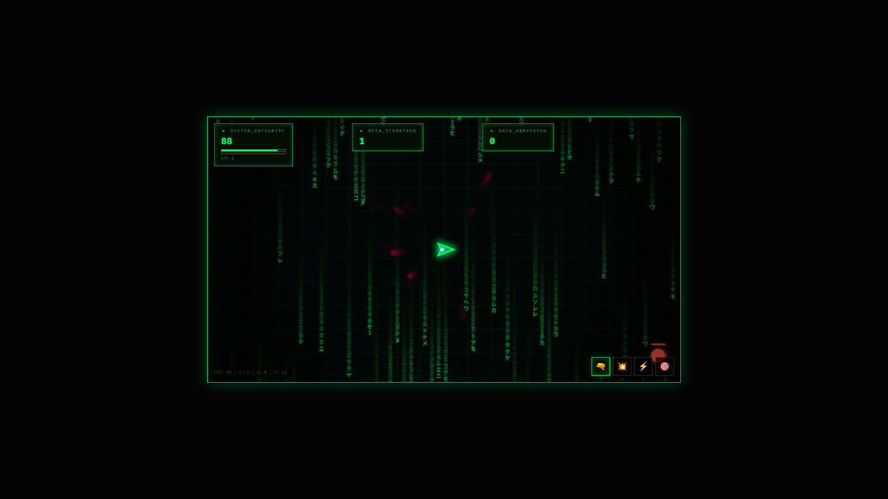

# 规则异常 // ANOMALY: SURVIVE THE META

> 一个基于 HTML5 Canvas 开发的硬核赛博朋克生存射击游戏。纯前端实现，零后端依赖。在无限突变的数字世界中，你能存活多久？

---

## 在线体验

[Live Demo](https://CNSleepybear.github.io/ANOMALY-Survive-the-Meta/)

## 游戏预览



---

## 核心玩法

**《规则异常》** 是一款融合了 **生存射击 + 肉鸽元素 (Roguelike)** 的网页游戏。玩家操控核心程序节点，在不断涌入的异常敌人中生存，同时应对每 13 秒强制重写一次的**世界规则**。

每轮规则突变会从 25+ 种异常中随机触发 1~2 条，彻底颠覆游戏物理、操控、视觉和敌我关系。适应，或是消亡。

### 四大武器系统

| 武器 | 键位 | 特性 |
|------|------|------|
| **脉冲手枪** | 1 | 标准弹道，均衡输出 |
| **散弹爆裂** | 2 | 6发散射，近距离毁灭 |
| **速射风暴** | 3 | 极高射速，压制弹幕 |
| **穿透狙击** | 4 | 穿透敌人，远程贯穿 |

**操控方式：** `WASD/方向键` 移动 · 鼠标瞄准+射击 · `1-4/Q/E/滚轮` 切换武器 · `F` 超频模式

---

## 25+ 种规则异常 (7大分类)

### 物理系
- **重力反转** - Y轴重力反向拖拽
- **零摩擦力** - 滑行几乎不停止
- **子弹反弹** - 子弹在边界反弹3次
- **磁力场** - 子弹受玩家磁力牵引偏转
- **斥力场** - 靠近的敌人被弹开

### 空间系
- **死亡固码** - 敌人死亡固化为源码阻挡块
- **视界偏转** - 画面周期性旋转90度
- **重力井** - 屏幕中心产生强大引力
- **虫洞干扰** - 玩家偶尔被随机传送
- **空间坍缩** - 活动范围逐渐缩小

### 交互系
- **动能反冲** - 射击产生超强后坐力
- **静止惩罚** - 站着不动持续扣血
- **生命链接** - 受伤时敌人也扣血
- **系统超频** - 射速翻倍但持续掉血

### 感知系
- **隐形入侵** - 敌人隐形，靠近才显形
- **镜像反转** - 左右方向反转
- **视野缩小** - 可视范围大幅缩小

### 时间系
- **子弹时间** - 全局0.5倍速
- **时间加速** - 全局1.5倍速

### 实体系
- **残影复制** - 移动留下战斗残影
- **幽灵模式** - 可穿墙但持续掉血
- **涅槃协议** - 死亡时满血复活一次

### 混沌系
- **弹幕地狱** - 敌人周期性发射子弹
- **熵增加速** - 全场速度逐渐加快
- **双倍伤害** - 所有人伤害翻倍
- **狂化潮** - 敌人速度暴增50%
- **混沌风暴** - 随机落雷伤害所有单位

---

## 升级养成系统

击杀敌人获取经验，升级后三选一强化：

| 升级项 | 效果 |
|--------|------|
| 生命扩容 | 最大生命+25 |
| 伤害强化 | 武器伤害+20% |
| 机动加速 | 移动速度+12% |
| 射速超频 | 射击冷却-20% |
| 护盾发生器 | 获得45护盾 |
| 纳米修复 | 生命恢复+0.1/秒 |
| 扩容弹匣 | 霰弹枪+2弹丸 |
| 穿甲改造 | 非穿透武器获得穿透 |
| 暴击系统 | 25%概率3倍伤害 |
| 链式闪电 | 命中时电弧传导 |
| 爆裂弹 | 子弹命中产生爆炸 |
| 系统超频 | 极限射速模式解锁 |
| 凤凰协议 | 死亡时满血复活一次 |
| 全面回复 | 回复50%最大生命 |

---

## 敌人类型

| 类型 | 特征 |
|------|------|
| **普通体** | 标准追击型 |
| **快速体** | 高移速低血量三角形态 |
| **重装体** | 低移速超高血量方块形态 |
| **精英体** | 高移速高血量菱形形态 |
| **Boss** | 每5波出现，五边形弹幕发射器 |

---

## 技术特性

- **Matrix 数字雨背景** - 沉浸式黑客环境
- **CRT 扫描线效果** - 复古终端质感
- **Glitch 故障艺术** - 规则异常时的视觉扰动
- **完整音效系统** - Web Audio API 合成动态音效
- **动态 BGM** - 程序化生成的环境电子音
- **性能监控 HUD** - 实时 FPS / 实体计数
- **成就系统** - 6项挑战成就
- **移动端适配** - 虚拟摇杆 + 触摸射击

---

## 本地运行

```bash
# 克隆仓库
git clone https://github.com/CNSleepybear/ANOMALY-Survive-the-Meta.git
cd anomaly-survive-the-meta

# 任意静态服务器
python3 -m http.server 8000
# 或
npx http-server -p 8000

# 浏览器访问 http://localhost:8000
```

> 纯前端实现，无需构建工具，双击 `index.html` 亦可直接运行。

---

## 浏览器兼容性

| 浏览器 | 支持情况 |
|--------|----------|
| Chrome 80+ | 完美 |
| Firefox 78+ | 完美 |
| Safari 13+ | 完美 |
| Edge 80+ | 完美 |

---

## 项目结构

```
anomaly-survive-the-meta/
├── index.html          # 游戏主入口
├── css/
│   └── style.css       # 赛博朋克视觉样式
├── js/
│   ├── main.js         # 主入口与游戏循环
│   ├── engine.js       # 核心游戏引擎
│   ├── renderer.js     # 渲染管线 (Matrix + CRT)
│   ├── rules.js        # 25+ 规则异常系统
│   ├── upgrades.js     # 升级养成系统
│   └── audio.js        # 音效与BGM引擎
├── assets/
│   └── screenshot.png  # 游戏截图
└── README.md
```

---

## 技术栈

- HTML5 Canvas 2D - 原生渲染引擎
- Web Audio API - 程序化音效合成
- CSS3 - Glitch特效、响应式布局
- Vanilla JavaScript (ES6+) - 零第三方依赖

---

## License

[MIT](./LICENSE)

---

## Credits

- 游戏设计与开发: 基于 ANOMALY 系列融合升级
- 字体: Fira Code, Noto Sans SC (Google Fonts)
- 灵感: 赛博朋克美学、肉鸽设计理念
